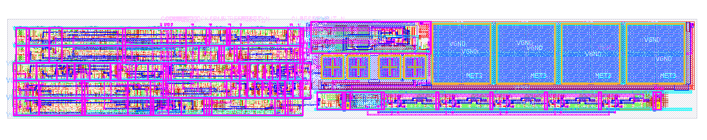
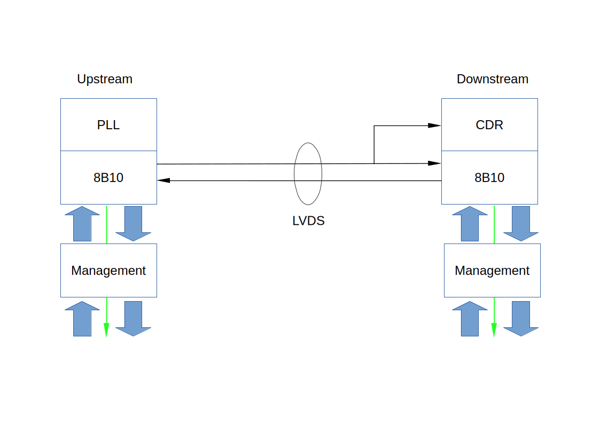
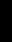

# QuickBus

This Tiny Tapeout chip is a test chip for a QuickBus implementation, plus it's a second attempt 
at the Sky PLL taped out too quickly in Sky26b, this one should support a wider range of frequencies,
hopefully up to 350MHz.

QuickBus is a prototype on-board chip to chip bus, think of it as SPI but up to 100 times faster - it's
a 4-wire bus 2 bits each way with LVDS signalling. In this case the upstream and downstream are both in the
same TT tile, no actual LVDS but full speed data tests.

## How the PLL works

The PLL looks like this

On the left hand side are Sky HS logic blocks, they include a programmable clock scaler (a 4 bit down counter set
by the COUNT\_* pins), a reset logic that looks for clock stability and after detecting 16 good clocks asserts RESET\_OUT\_N, and a phase detector that compares the output of the clock scaler with a reference clock and drives the charge pump.

On the right are the analog blocks. Along the bottom is a variable frequency oscillator (VCO),
5 stages, Top left is the charge pump that drives the VCTRL output voltage into the oscillator. The 4 large square boxes to the right are capacitors charged from VCTRL through a long poly resistor that snakes the width of the block. The 2 small square boxes to the right are a smaller capacitor also on VCTRL.. The other 2 caps are decoupling caps for the charge pump.

## Interface

The resulting block is intended to be a drop in to Sky TT projects, Its interface is very simple, inputs are:

* COUNT\_3-COUNT\_0 - these scale the reference clock by N-1 (so a value of 1 means 2 times, a value of 7 means 8 times) for example with a value of 7 and a 25MHz reference clock the PLL should generate 200MHz
* REFCLK - this is the input reference clock, this is intended to be connected to the Tiny Tapeout tile clock
input. If you want more flexibility in generated frequencies you can divide down to a lower frequency, the phase detector only looks at the rising edge of the reference clock so it doesn't need to be a square wave (jitter added to the reference clock is reflected in jitter in the output clock).
* RESET\_N - this an async reset, it can (should) be applied before the PLL starts. The PLL starts when RESET\_N is released. It is intended to be connected directly to the Tiny Tapeout rst\_n pin.

Outputs are:
* CLK - the resulting clock - at reset this in undefined, some time after RESET\_N is removed it will be active
at the desired frequency (COUNT\+1)\*f(REFCLK) (it's your responsibility to choose frequencies that the PLL can
actually generate - roughly 50-300MHz, outside that range the results are undefined). Note in the rush to tape out the VCO range may have shifted up, 50MHa may not lock well - we'll see, that's what test tapeouts are for.
* RESET\_OUT\_N - this is a synchronous signal (wrt CLK) that is asserted by RESET\_N until the clock is fairly stable - it's intended use is to hold a design in reset until the clock is stable, through the period when it might be thrashing around as the VCO starts up - your design should ignore the Tiny Tapeout rst\_n and use this signal - note this signal is generated internally, your design might have a deep clock tree, it may be useful to run this through a flop before you use it to meet setup/hold. This signal is asserted by RESET\_N and cleared when the clock becomes stable enough to use, it is not asserted again until RESET\_N is asserted. This signal is cleared BEFORE the clock is completely stable (we'll characterize this with spice later), clock freq may go slightly higher that desired (a few percent) as it settles.

With the reference clock set to 25MHz these frequencies shoukld be possible, anything after ~300MHz may not be real (out of the range of the VCO)
| COUNT    |  multiplier  | CLK Freq |
| -------- |  -------     | --------
| 0001     | 2            | 50MHz    |
| 0010     | 3            | 75MHz    |
| 0011     | 4            | 100MHz   |
| 0100     | 5            | 125MHz   |
| 0101     | 6            | 150MHz   |
| 0110     | 7            | 175MHz   |
| 0111     | 8            | 200MHz   |
| 1000     | 9            | 225MHz   |
| 1001     | 10           | 250MHz   |
| 1010     | 11           | 275MHz   |
| 1011     | 12           | 300MHz   |
| 1100     | 13           | 325MHz*  |
| 1101     | 14           | 350MHz*  |
| 1110     | 15           | 375MHz*  |

With a divides by 2 reference clock set to 12.5MHz these frequencies shoukld be possible, number under 50MHz may be out of the range of the VCO)
| COUNT    |  multiplier  | CLK Freq |
| -------- |  -------     | --------
| 0001     | 2            | 25MHz*    |
| 0010     | 3            | 37.5MHz*    |
| 0011     | 4            | 50MHz   |
| 0100     | 5            | 62.5MHz   |
| 0101     | 6            | 75MHz   |
| 0110     | 7            | 87.5MHz   |
| 0111     | 8            | 100MHz   |
| 1000     | 9            | 112.5MHz   |
| 1001     | 10           | 125MHz   |
| 1010     | 11           | 137.5MHz   |
| 1011     | 12           | 150MHz   |
| 1100     | 13           | 162.5MHz  |
| 1101     | 14           | 175MHz  |
| 1110     | 15           | 187.5MHz  |
| 1111     | 15           | 200MHz  |

# QuickBus

Basic QuickBus looks like this

A QuickBus connects two chips over LVDS, it has an upstream chip and a downstream chip, if you want to
compare it with SPI Upstream is 'M' and Downstream is 'S'. Upstream is in charge, Downstream responds.

Upstream has a PLL it sets the frequency for both sides, data is sent at all times even when idle, 
on the Downstream side is a Clock Data Recovery unit (essentially a PLL locked to the incoming data stream)
downstream runs on the recovered clock (essentially the PLL's clock with some jitter and an arbitray delay).

Data is sent/received using the standard 8b10 NRZ encoding - this sends 8 bits of data and a handfull of
framing symbols in 10 bits of on-wire data sith a guaranteed number of edges to keep the CDR running. 
8B10 has some minor error detection facilities, these are reported to the next layer up.

Data sent from Downstream to Upstream is sent with the Recovered Clock and received with the PLL clock,
these are the same frequency clock - with a bit of jitter and an arbitrary delay (might be several bit
times) - the Deskew is a variable length delay line and a phase detector that deals with the subbit-delay
(and some jitter) followed by a variable length shift register to align the incoming symbols with
outgoing ones.

On both sides a byte clock is generated (intended to be used by all the logic below the) this is the
green arrows showed on the diagram above it is 1/10 the frequency of the PLL, both sides have the same
clock, they have an arbitrary phase relationship.

The "Byte interface" is actually 9 bits, 8 data 'D' bits and a 'K' bit, if K is 0 the data is
normal data, if it's a 1 then it's one of the standard 8b10 framing symbols, on reception K==1 and
D==00 means an error.

Sitting above the bit framer and clock management is a management unit:

The management unit handles link startup, frequency negotgiation, bus driver optimisation and reversing
miswired buses.  It also handles error recovery, and (eventually) hot staging. When not in use it steps
out of the way of the next level protocols.

The byte level interface is the same on both sides, it looks like:

System:
* CLK - 1/10 the PLL clock

Outgoing (outputs):
* XMT\_D[7:0] - outgoing data
* XMT\_K      - outgoing symbol
* XMT\_READY - data is sent when this is asserted, if not set an IDLE symbol is sent, IDLEs are swallowed by the remote receiver

Incoming (inputs):
* RCV\_D[7:0] - ingoing data
* RCV\_K      - ingoing symbol
* RCV\_READY - data is ready when this is asserted there is no flow control so you must do something wigth the data or drop it
* RCV\_ALIGN - this is set when EIE/END/EDB symbols are received or an error is detected - it is optional and is intended for systems where a fifo is used where the read port is multiple bygtes wide

TBD - an upper level protocol for register/memory access (similar to existing SPI systems).

# Multidrop

(may or may not get this in to TT this time)

The basic idea here is that one Upstream node could talk to multiple Downstream nodes, sharing a single
downstream data pair but each with a unique upstream pair for responses, Upstream chooses a PLL frequency
that all devices can talk (and the wiring will handle). This means the Upstream needs N+1 pairs to talk
to N devices while Downstream devices continue to need 2 pairs.

## Implementation

This is a 2x2 TT tile.
with the PLL laid along the bottom, the tile connects RESET\_N to the TT rst\_n and COUNT to ui\_in\[3:0\]. ui\_in\[7:4\] are connected to a down counter from the TT clk, the output is used to drive REFCLK (unless ui\_in\[7:4\]==0 in which case REFCLK is driven directly from the TT clk.

The output CLK is connected to uo\_out\[0\] a 4 bit counter driven from CLK is connected to uo\_out\[5:2\] finally RESET\_OUT\_N is connected to uo\_out\[1\]. It is expected that at many frequencies the upper bits of the counter and the output clock wont make it to the TT pins.

## How to test

Drive ui\_in with 8'n0000\_0001 (2 times freq), Set the TT clock to 25MHz. Assert reset, uo\_out\[1\] should go low, clear reset, uo\_out\[1\] should high. If we get this far the PLL is making a good clock. You can now look at the uo\_out pins on a scope to check the freqs (should be 50MHz though that's at the tough lower end of the final VCO, 8'n0000\_0010 will give you 75MHz, try looking at uo\_out\[3:2\]which shoukld be 1/2 and 1/4 the internal clock freq)

## External hardware

a scope to look at the output signals
